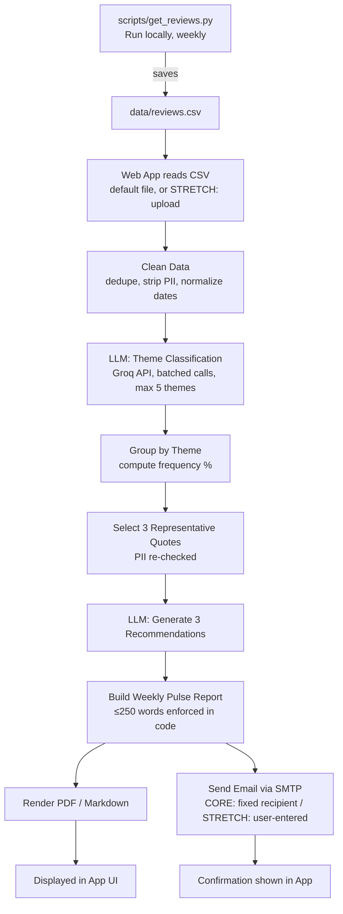
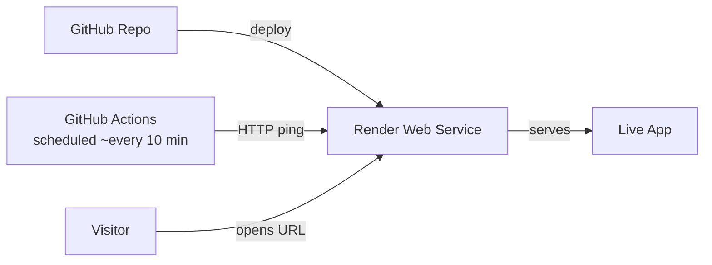

# Project Brief: App Review Insights Analyzer (Groww)

**For: Antigravity (agentic coding assistant)**
**Context: NextLeap PM Fellowship — Learn in Public, Milestone 5 (LIP5)**
**Deadline: Aug 16, 11:59 PM IST**
**Product: Groww (same as LIP4 milestone)**

**Previous milestone (LIP4) — for reference/continuity:**
- GitHub: https://github.com/hardiksharma29002-stack/groww_mutual_fund_faq_bot
- LinkedIn post: https://www.linkedin.com/posts/hardik-sharma-129288319_nextleappmfellowship-productmanagement-rag-share-7490290701621043200-f8yB/

---

## 0. Two Tiers — Read This First

This build has a **CORE tier** (what LIP5 actually grades) and a **STRETCH tier** (extra polish for a better public demo). Build and fully verify CORE first. Only move to STRETCH if time remains before the deadline.

### CORE (must work, this is graded)
- Import Groww's own public reviews (last 8–12 weeks) into a CSV
- Classify into max 5 themes, generate weekly note (top 3 themes, 3 quotes, 3 actions, ≤250 words), no PII
- Send the report via email to a **fixed recipient** (the builder's own inbox/alias)
- Deploy with a working public link
- README, sample CSV, weekly note file, and email screenshot as proof

### STRETCH (nice to have, not graded, build only if time allows)
- "Upload your own CSV" button so any visitor can run the pipeline on their own app's reviews (not just Groww)
- "Try with sample data" button (ships a `sample_reviews.csv`) so visitors without a file can still test it
- A plain text email input field so visitors can have the report sent to their own address
- No Google Auth / OAuth for this — a plain text email field is sufficient (see Section 7)

---

## 1. What This Is

A web application (framework choice is open — Flask, FastAPI, or similar; NOT a no-code tool like n8n/Zapier, must be real code) that:

1. Reads Groww app reviews from a CSV (scraped separately, see Section 3)
2. Uses an LLM (Groq API, free tier) to classify reviews into max 5 themes
3. Picks 3 real representative user quotes (PII-scrubbed)
4. Generates 3 actionable product recommendations
5. Produces a one-page "Weekly Product Pulse" report (≤250 words)
6. **Sends** that report as a real email via SMTP

---

## 2. Architecture

```
app-review-insights/
├── app/                        # web app (framework TBD by Antigravity/builder — not mandated as Streamlit)
│   ├── main.py                  # entry point, routes/UI
│   └── ...
├── pipeline/
│   ├── clean.py                  # dedupe, strip PII, normalize dates
│   ├── classify.py               # Groq LLM call — BATCHED (see Section 4), max 5 themes enforced in code
│   ├── group_quotes.py           # group by theme, select 3 representative quotes, PII re-check
│   ├── insights.py               # Groq LLM call: generate 3 recommendations, no hallucination
│   ├── report.py                  # fills Weekly Pulse template, enforces ≤250 words in code
│   └── email_sender.py           # builds + sends email via SMTP (smtplib + Gmail App Password)
├── scripts/
│   └── get_reviews.py             # standalone script, run manually/locally — pulls fresh reviews → CSV. NOT part of the live web app.
├── data/
│   ├── reviews.csv                 # current week's Groww reviews (CORE — used for the graded email send)
│   └── sample_reviews.csv          # STRETCH — generic sample so visitors can "try with sample data"
├── keepalive/
│   └── ping.yml                     # GitHub Actions workflow: pings the Render URL every ~10 min so free tier doesn't sleep
├── requirements.txt
├── .env.example                     # placeholders: GROQ_API_KEY, SMTP_EMAIL, SMTP_APP_PASSWORD, RECIPIENT_EMAIL
├── .gitignore                        # must include .env
└── README.md
```

**Key separation of concerns:**
- `scripts/get_reviews.py` is run manually/locally by the builder whenever fresh Groww reviews are needed. It is NOT triggered by the live web app. It uses `google-play-scraper` / `app-store-scraper` (public exports only, no login-based scraping) and writes `data/reviews.csv`.
- The live web app never scrapes anything itself. It only ever reads a CSV — the default `data/reviews.csv` for the CORE flow, or (STRETCH) a user-uploaded file.
- This separation is what satisfies the "reusable workflow" requirement: swapping `data/reviews.csv` for a new week's file and re-running produces a fresh report with zero code changes.

---

## 3. Pipeline Steps (in order)

**Step 1 — Import**
CSV columns: `rating, title (optional), text, date`. Last 8–12 weeks only. Public review exports only, no login-based scraping.

**Step 2 — Clean**
- Drop empty/duplicate reviews, normalize dates
- Strip PII (regex: emails, phone numbers) in code, BEFORE anything reaches the LLM — do not rely on prompting alone

**Step 3 — Classify (LLM, Groq)**
- Assign each review to exactly ONE theme from a fixed list of max 5 (e.g. Onboarding, KYC, Payments, Statements, Withdrawals — adjust to what's actually in the data)
- **Batch reviews per API call** (e.g. 20–30 reviews per call, not one call per review) — this keeps latency reasonable for a user waiting on the web page (target: under ~30–40 seconds even for 500 reviews)
- Force structured JSON output; validate the returned theme is one of the allowed 5 in code — reject/retry if the model invents a 6th theme

**Step 4 — Group + Quote Selection**
- Group by theme, compute frequency %
- Select exactly 3 representative quotes across top themes
- Re-run PII regex check on the final quotes as a safety net

**Step 5 — Insight Generation (LLM)**
- Generate exactly 3 recommendations from theme frequencies + quotes
- System instruction: only use information present in the provided reviews — no hallucinated causes, features, or segments

**Step 6 — Weekly Pulse Report**
- Structure: Top 3 Themes (with % + one-line description) → 3 Quotes (no PII) → 3 Recommended Actions → brief summary
- Enforce ≤250 words **in code** (word count check, trim/regenerate if over)
- Export as Markdown + PDF (`reportlab` or similar)

**Step 7 — Email**
- Subject: `Weekly Product Review Insights`
- Body: rendered Weekly Pulse report, professionally formatted
- CORE: sent via SMTP to a fixed recipient (`RECIPIENT_EMAIL` env var — the builder's own inbox/alias)
- STRETCH: recipient becomes whatever the visitor types into a plain text email field (validate format in code; no OAuth needed — see Section 7)
- Show success/failure confirmation in the UI after sending

---

## 4. Latency Target (for the STRETCH upload flow)

Because visitors will wait on-screen for results, classification must be batched (Step 3). Rough targets with Groq:
- ~100–200 reviews: 5–15 seconds
- ~500 reviews: 20–40 seconds

Show a loading indicator during processing so the wait doesn't feel broken.

---

## 5. Constraints (enforce in code, not just prompts)

- Max 5 themes — hard-coded allow-list, validated after every LLM call
- Report ≤250 words — programmatic word count check
- Exactly 3 themes shown, 3 quotes, 3 recommendations
- No PII anywhere in any output — regex scrub + spot check
- Public review data only, no login-based scraping
- Swapping the input CSV must produce a fresh report with zero code changes

---

## 6. Tech Stack

| Layer | Tool |
|---|---|
| Web framework | Flask or FastAPI (builder's choice — not Streamlit) |
| Backend | Python |
| LLM | Groq API (free tier) |
| Data processing | Pandas |
| Review import (offline script) | `google-play-scraper`, `app-store-scraper` |
| PDF export | `reportlab` |
| Email sending | Python `smtplib` + Gmail App Password (requires 2-Step Verification enabled on the Gmail account first) |
| Hosting | Render (free tier) |
| Keep-alive | GitHub Actions scheduled workflow pinging the Render URL every ~10 min |
| Secrets | `.env` locally (gitignored), Render environment variables in production |

**Note on hosting:** Railway was considered but rejected — it now requires a credit card even for its trial, and its ongoing free tier ($1/month credit) is too limited for reliable use through the deadline. Render's free tier needs no card and is sufficient with the keep-alive workaround.

---

## 7. Email Recipient Logic — Important

- **CORE:** one fixed recipient, set via `RECIPIENT_EMAIL` env var (the builder's own address/alias). Every generated report — regardless of who is using the deployed link — sends here for the graded flow.
- **STRETCH:** add a plain text input field ("Enter your email to receive this report"). No Google/OAuth sign-in — that requires app verification from Google which can take days/weeks, incompatible with this deadline. A plain input field achieves the same practical outcome (report lands in whatever inbox the visitor names) with a fraction of the complexity. Validate the input is a well-formed email address before sending; consider basic rate-limiting to prevent abuse of the send feature.

---

## 8. Deployment

- Deploy on **Render** free tier
- Add `keepalive/ping.yml` — a GitHub Actions scheduled workflow (e.g. every 10 minutes) that sends an HTTP GET to the deployed URL, preventing the free-tier instance from sleeping after 15 min idle
- Store `GROQ_API_KEY`, `SMTP_EMAIL`, `SMTP_APP_PASSWORD`, `RECIPIENT_EMAIL` as Render environment variables — never commit real secrets

---

## 9. Architecture Diagrams (include these in README.md — GitHub renders Mermaid natively)

**Pipeline flow:**



**Deployment flow:**



---

## 10. Deliverables Checklist (from official LIP5 rubric)

- [ ] Working prototype link (Render) — no video needed
- [ ] Latest one-page Weekly Pulse note (PDF/DOCX/MD)
- [ ] Email proof — screenshot of the received email (since it's actually sent, not just drafted)
- [ ] Reviews CSV used (sample/redacted is fine)
- [ ] README.md containing:
  - Project overview
  - Data source
  - Workflow explanation + the Mermaid diagrams from Section 9
  - Installation steps
  - Technologies used
  - How to re-run for a new week's reviews (re-run `scripts/get_reviews.py`, replace `data/reviews.csv`)
  - Theme legend (the fixed list of 5 themes and what each covers)
  - Known limitations
  - **Screenshots of the deployed website** (add these AFTER deployment — take screenshots of the live app, place them in a `docs/screenshots/` folder, and embed them in the README with standard Markdown image syntax)

---

## 11. Skills Being Evaluated

- **W2 — LLMs & Prompting:** summarization quality, quote selection judgment, tone control
- **W3 — AI Workflow Automations:** Import → Group → Generate Note → Send Email, reusable for any new CSV without code changes

This is a portfolio artifact — code should be clean and explainable. The builder should be able to walk through every design decision (e.g., why theme validation happens in code, why PII scrubbing isn't left to the prompt alone, why the pipeline is separated from the scraper).
