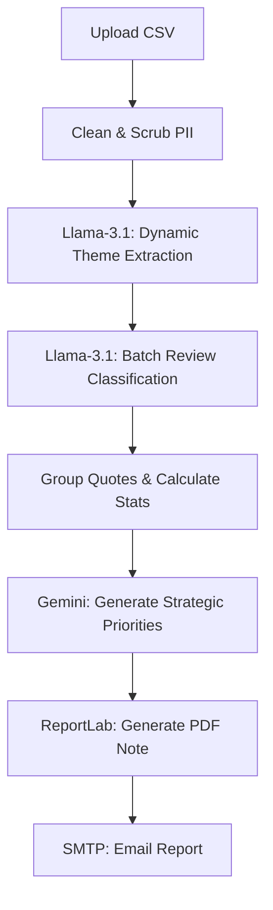

# App Review Insights Analyzer

An AI-powered workflow automation tool that imports public app reviews, cleans them for privacy, extracts core themes using LLMs, and generates a one-page Weekly Pulse report (PDF) delivered via email.

## 🚀 Project Overview
This project was built to automate the tedious process of analyzing weekly app reviews. It leverages a modern stack to provide actionable insights for Product Managers in under a minute.

**Tech Stack:**
- **Frontend:** Next.js (React), TailwindCSS, Framer Motion (3D/Cinematic UI)
- **Backend:** FastAPI (Python), Pandas, ReportLab
- **LLMs:** Llama-3.1-8b (via Groq for rapid classification), Gemini 2.5 Flash (for strategic recommendations)
- **Automation:** Python `smtplib` for automated SMTP email dispatch

---

## 🛠️ How It Works (Pipeline)



1. **Import:** Accepts a raw CSV export of public app reviews (Rating, Title, Text, Date).
2. **Clean:** Drops duplicates and aggressively scrubs PII (Emails, Phone numbers, IDs) using regex before the data ever touches an LLM.
3. **Classify:** Dynamically extracts the top 5 business themes from the dataset and classifies every review into one of those buckets using Groq's high-speed API.
4. **Generate Note:** Compiles the Top 3 themes, 3 most representative user quotes, and 3 actionable recommendations into a scannable, strictly formatted PDF report.
5. **Email Draft:** Dispatches the final PDF directly to a stakeholder's inbox.

---

## 🏃‍♂️ How to Re-Run for a New Week
Running this pipeline for a new dataset is incredibly simple. You do not need to write any code.

1. **Get the Data:** Export a new CSV of public app reviews. Ensure it has at least a `text` and `rating` column.
2. **Start the App:** Ensure both the FastAPI backend and Next.js frontend are running locally.
3. **Upload:** Open `http://localhost:3000` in your browser. Drag and drop your new CSV file into the upload zone.
4. **Analyze:** Click "Run Analysis". The AI will dynamically adjust to the new data, extract new themes, and generate a fresh report.
5. **Download/Email:** Click "Download PDF" or enter an email address to send the new report.

---

## 🏷️ Theme Legend
Unlike traditional hardcoded systems, this application uses **Dynamic Theme Extraction**. 

During the pipeline execution, Llama-3.1 samples the dataset and generates exactly 5 distinct business themes tailored strictly to the *current* data. 
For example, if you upload an e-commerce dataset, it will extract themes like:
- **Checkout Experience:** Issues or praises regarding the cart and payment gateway.
- **Delivery Experience:** Comments regarding shipping speed or delivery partners.
- **Product Variety:** Feedback on the available inventory.
- **App Usability:** General feedback on the UI/UX and navigation.
- **Customer Support:** Comments on refunds, returns, or support tickets.

Because the themes are dynamically generated based on the CSV, the system automatically adapts to entirely different industries (e.g. Fitness Apps vs. Finance Apps) without any code changes.

---

## ⚙️ Local Installation

### 1. Backend (FastAPI)
```bash
cd app-review-insights
python -m venv venv
source venv/Scripts/activate # Windows
pip install -r requirements.txt
```
Create a `.env` file in `app-review-insights` with your API keys:
```env
GROQ_API_KEY=your_groq_key
GEMINI_API_KEY=your_gemini_key
SMTP_EMAIL=your_bot_email@gmail.com
SMTP_APP_PASSWORD=your_16_char_app_password
```
Start the backend:
```bash
python -m uvicorn app.main:app --port 8000
```

### 2. Frontend (Next.js)
```bash
cd stitch_rapid_action_engine/frontend
npm install
npm run dev
```
Open `http://localhost:3000` in your browser.

---

## ⚠️ Known Limitations
- **LLM Non-determinism:** Because the insights generation has a slight temperature (`0.3`), the exact phrasing of recommendations may vary slightly if you run the exact same CSV twice.
- **PDF Styling:** The PDF is intentionally kept minimal and strictly text-based (no complex charts) to adhere to scannability constraints (≤250 words).
- **Rate Limits:** The Groq API is lightning fast, but free-tier rate limits mean processing datasets larger than 200 reviews at once may trigger exponential backoff delays.
