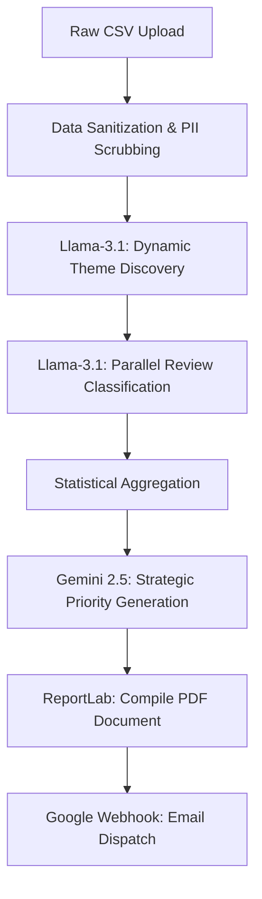

  
# 🚀 App Review Insights Analyzer
**AI-Powered Feedback Intelligence at the Speed of Light**

---

## 🌟 The Vision

Product managers and founders drown in unstructured user feedback. Reading through thousands of App Store or Google Play reviews to find the "signal" in the noise takes days. 

**App Review Insights Analyzer** completely automates this process. You simply upload a CSV of raw app reviews, and within seconds, a highly parallelized LLM pipeline cleans the data, discovers the top business themes, classifies every review, and generates a gorgeous, one-page **Weekly Pulse PDF Report** delivered straight to any email address.

---

## 🔗 Live Demo
Try the live production application here:  
👉 **[App Review Analyzer on Vercel](https://app-review-analyzer-theta.vercel.app/)**

*(To test the application, simply download a sample CSV of app reviews and upload it to the cinematic interface!)*

---

## 🧠 Intelligent Pipeline Architecture

This application utilizes a completely dynamic, multi-agent AI pipeline. It does not rely on hardcoded keywords; instead, it actually reads and understands your specific data.

### 1. Dynamic Theme Discovery
Unlike traditional NLP tools, this engine reads a sample of your dataset and dynamically generates the Top 5 business themes specific to *your* app. Whether it's an e-commerce app ("Checkout Flow") or a fitness tracker ("Syncing Speed"), the AI adapts instantly.

### 2. High-Speed Parallel Classification
Powered by **Groq's LPU inference engine**, the backend chunks hundreds of reviews and categorizes them against the discovered themes in mere seconds, resulting in a quantifiable breakdown of what users are talking about.

### 3. Actionable Intelligence
**Google's Gemini 2.5** analyzes the statistical breakdown and the raw quotes to generate three highly specific, actionable Strategic Priorities for the product team.

### 4. Automated Distribution
The entire analysis is compiled into a strictly formatted, scannable PDF and instantly dispatched to any stakeholder's email address via a secure Google Apps Script Webhook.

---

## 🎨 Cinematic User Experience

The frontend is engineered to be as impressive as the backend. Built with **Next.js**, **TailwindCSS**, and **Framer Motion**, the interface features:
- A breathtaking glassmorphism design system.
- Fluid, choreographed multi-stage loading sequences that visualize the AI's thought process.
- HSL-tailored dark mode aesthetics with vibrant, glowing accents.
- Responsive drag-and-drop file uploaders with instant feedback.

---

## 🛡️ Privacy & Security First

- **Zero Data Retention:** Uploaded CSVs are processed completely in memory and instantly destroyed. No customer data is ever saved to a database.
- **Aggressive PII Scrubbing:** Before any review touches an LLM, the Python backend uses regex heuristics to aggressively scrub Personal Identifiable Information (Emails, Phone Numbers, IDs).
- **Secure Email Webhook:** Email dispatch is handled via an isolated Google Apps Script Webhook, ensuring no SMTP credentials or API keys are ever exposed to the client.

---

  <i>Built to turn noise into signal.</i>

