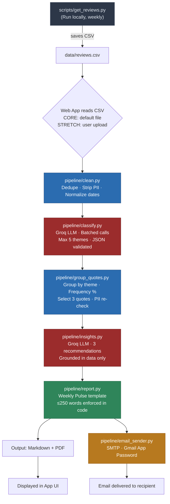
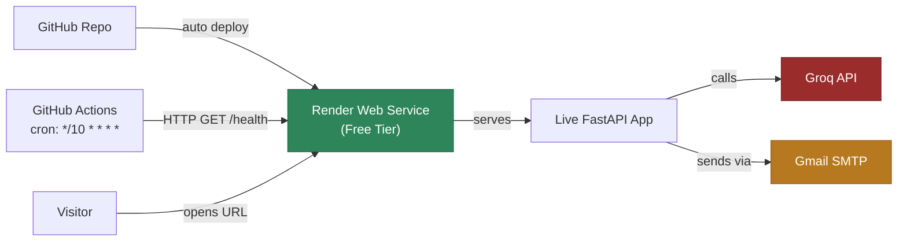
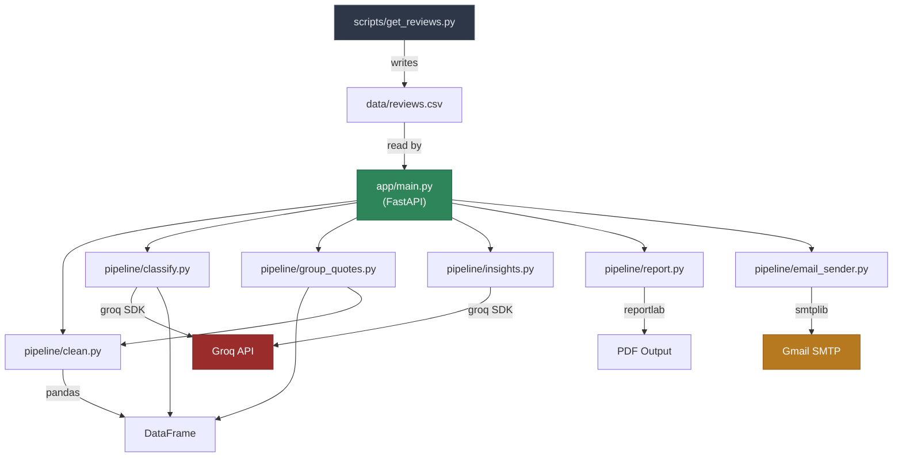
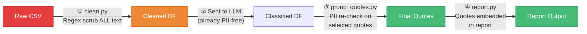
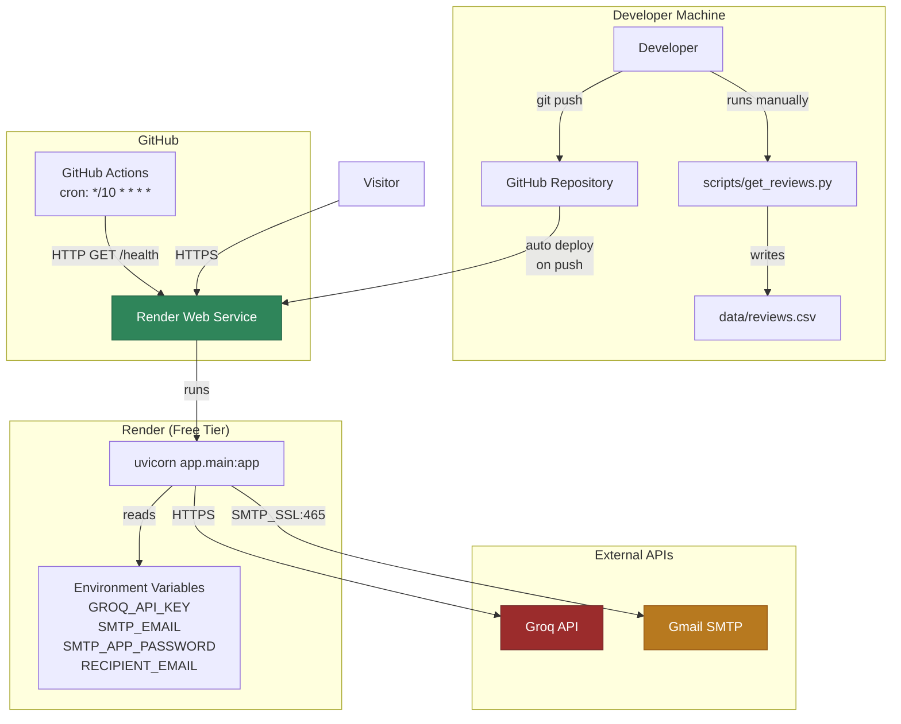
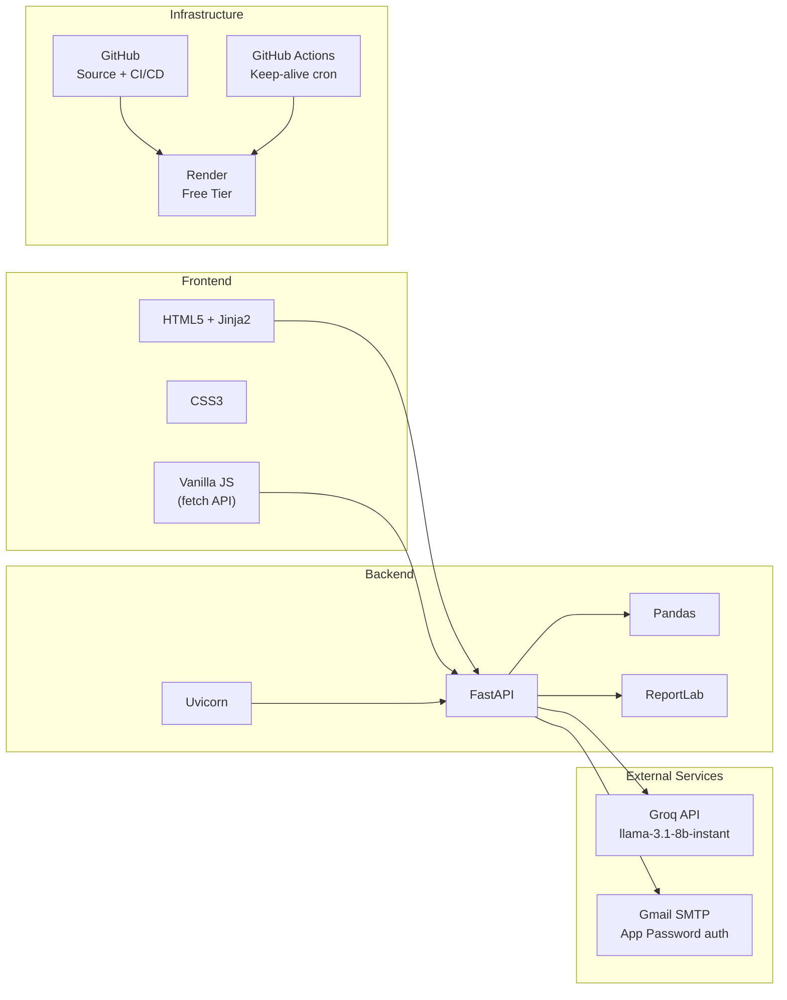

# Architecture — App Review Insights Analyzer (Groww)

> Companion to [implementation.md](file:///c:/Users/hardi/OneDrive/Desktop/app_analysis/implementation.md) and [PROB_statement.md](file:///c:/Users/hardi/OneDrive/Desktop/app_analysis/PROB_statement.md)

---

## 1. System Overview

The App Review Insights Analyzer is a **Python web application** that ingests public Groww app reviews from a CSV, runs them through an LLM-powered analysis pipeline, produces a structured "Weekly Product Pulse" report, and emails it via SMTP — all through a browser UI hosted on Render.

```
┌─────────────────────────────────────────────────────────────────────┐
│                        SYSTEM BOUNDARY                              │
│                                                                     │
│  ┌──────────┐    ┌───────────────────────────────────┐              │
│  │  Offline  │    │         Live Web Application       │              │
│  │  Scraper  │    │  ┌─────────┐   ┌───────────────┐  │              │
│  │  Script   │───▶│  │ FastAPI │   │   Pipeline     │  │              │
│  │           │CSV │  │ Server  │──▶│   Modules      │  │              │
│  └──────────┘    │  └────┬────┘   └───────┬───────┘  │              │
│                  │       │                │           │              │
│                  │       ▼                ▼           │              │
│                  │  ┌─────────┐   ┌───────────────┐  │              │
│                  │  │  HTML   │   │  Groq LLM API │  │              │
│                  │  │  UI     │   │  (external)   │  │              │
│                  │  └─────────┘   └───────────────┘  │              │
│                  │       │                │           │              │
│                  │       ▼                ▼           │              │
│                  │  ┌──────────────────────────────┐  │              │
│                  │  │  Report (MD + PDF) + Email   │  │              │
│                  │  └──────────────────────────────┘  │              │
│                  └───────────────────────────────────┘              │
└─────────────────────────────────────────────────────────────────────┘
```

---

## 2. High-Level Architecture Diagram (Mermaid)

### 2.1 Pipeline Flow



> 🔴 Red nodes = LLM calls (Groq API) · 🔵 Blue nodes = Local data processing · 🟢 Green = Report output · 🟡 Yellow = Email

### 2.2 Deployment Flow



### 2.3 Request-Response Flow (User Interaction)

```mermaid
sequenceDiagram
    actor User
    participant UI as Browser UI
    participant API as FastAPI Server
    participant Pipeline as Pipeline Modules
    participant Groq as Groq LLM API
    participant SMTP as Gmail SMTP

    User->>UI: Click "Run Analysis"
    UI->>API: POST /analyze
    API->>Pipeline: clean_reviews(df)
    Pipeline-->>API: cleaned DataFrame

    loop Batched (25 reviews/call)
        API->>Groq: Classify batch
        Groq-->>API: JSON themes
    end
    API->>Pipeline: select_quotes(df)
    Pipeline-->>API: themes + quotes

    API->>Groq: Generate 3 recommendations
    Groq-->>API: JSON recommendations

    API->>Pipeline: build_report(...)
    Pipeline-->>API: markdown + PDF bytes
    API-->>UI: Render report in page

    User->>UI: Click "Send Email"
    UI->>API: POST /send-email
    API->>SMTP: Send email + PDF attachment
    SMTP-->>API: 250 OK
    API-->>UI: "Email sent successfully ✓"
```



---

## 3. Component Architecture

### 3.1 Layer Diagram

```
┌─────────────────────────────────────────────────────────────┐
│                     PRESENTATION LAYER                       │
│  app/main.py · app/templates/index.html · app/static/       │
│  FastAPI routes that act as a REST API backend. Next.js     │
│  handles the cinematic frontend UI while FastAPI            │
│  orchestrates the ML pipeline logic.                        │
├─────────────────────────────────────────────────────────────┤
│                     APPLICATION LAYER                        │
│  Orchestrates pipeline steps in sequence                     │
│  Manages request/response, file I/O, error handling          │
├─────────────────────────────────────────────────────────────┤
│                     PIPELINE LAYER                           │
│  clean.py → classify.py → group_quotes.py → insights.py     │
│  → report.py → email_sender.py                              │
│  Each module is stateless, single-responsibility             │
├─────────────────────────────────────────────────────────────┤
│                     EXTERNAL SERVICES                        │
│  Groq API (LLM)  ·  Gmail SMTP  ·  Google Play Scraper      │
├─────────────────────────────────────────────────────────────┤
│                     DATA LAYER                               │
│  data/reviews.csv · data/sample_reviews.csv · output/*.pdf   │
│  File-based storage (no database)                            │
└─────────────────────────────────────────────────────────────┘
```

### 3.2 Module Dependency Graph



---

## 4. Data Flow Architecture

### 4.1 Data Schema Through Pipeline

```
INPUT CSV                    AFTER CLEAN               AFTER CLASSIFY
┌────────────────────┐      ┌──────────────────┐      ┌───────────────────────┐
│ rating  │ int 1-5  │      │ rating │ int 1-5 │      │ rating │ int 1-5      │
│ title   │ str|null │  ──▶ │ title  │ str     │  ──▶ │ title  │ str          │
│ text    │ str      │      │ text   │ str     │      │ text   │ str          │
│ date    │ str      │      │ date   │ YYYY-MM │      │ date   │ YYYY-MM-DD   │
└────────────────────┘      │        │    -DD  │      │ theme  │ str (1 of 5) │
                            └──────────────────┘      └───────────────────────┘
         ▼ PII scrubbed              ▼ deduped                  ▼ validated


AFTER GROUP + QUOTES                    FINAL REPORT
┌────────────────────────────┐         ┌─────────────────────────────┐
│ themes: [                  │         │ markdown_str: str           │
│   {name, count, pct, desc} │   ──▶   │ pdf_bytes: bytes            │
│ ]                          │         │                             │
│ quotes: [                  │         │ Contains:                   │
│   {theme, text, rating}    │         │  - 3 themes (name, %, desc) │
│ ]                          │         │  - 3 quotes (PII-free)      │
│ recommendations: [str x3]  │         │  - 3 recommendations        │
└────────────────────────────┘         │  - ≤250 words (enforced)    │
                                       └─────────────────────────────┘
```

### 4.2 PII Scrubbing Points



**Two-pass PII defense:**
- **Pass 1 (clean.py):** Regex scrub on entire dataset before any LLM call
- **Pass 2 (group_quotes.py):** Regex re-check on the 3 selected quotes before they enter the report

---

## 5. API Architecture

### 5.1 Route Map

```
FastAPI Application
│
├── GET  /                    → Serve index.html (Jinja2)
│
├── POST /analyze             → Run pipeline on data/reviews.csv (CORE)
│   ├── Request:  (no body)
│   ├── Response: { report_md, report_html, themes, quotes, recommendations }
│   └── Side effect: saves PDF to output/
│
├── POST /analyze/upload      → Run pipeline on uploaded CSV (STRETCH)
│   ├── Request:  multipart/form-data { file: CSV }
│   ├── Validation: .csv, required columns, max 5MB
│   └── Response: same as /analyze
│
├── POST /send-email          → Send last report via SMTP
│   ├── Request:  { recipient?: string }  (CORE: uses env var; STRETCH: from body)
│   └── Response: { success: bool, message: string }
│
├── GET  /report/download     → Download latest PDF
│   └── Response: application/pdf
│
└── GET  /health              → Health check (for keep-alive)
    └── Response: { status: "ok" }
```

### 5.2 Error Handling Strategy

| Error Type | HTTP Code | User-Facing Message | Recovery |
|------------|-----------|---------------------|----------|
| CSV missing/invalid | 400 | "No valid reviews file found" | Show upload option |
| Groq API rate limit | 503 | "Analysis service busy, retry in 30s" | Auto-retry with backoff |
| Groq invalid response | 500 | "Analysis failed, please retry" | Retry once, then fail |
| SMTP auth failure | 500 | "Email service unavailable" | Log error, suggest retry |
| SMTP recipient invalid | 400 | "Invalid email address" | Prompt user to correct |
| Report generation fail | 500 | "Report generation error" | Return partial data if available |

---

## 6. External Service Integration

### 6.1 Groq LLM API

```
┌──────────────────────────────────────────────────┐
│                  Groq Integration                 │
│                                                   │
│  SDK: groq Python package                         │
│  Auth: GROQ_API_KEY (env var)                     │
│  Base URL: https://api.groq.com/openai/v1         │
│                                                   │
│  ┌─────────────────┐  ┌─────────────────────────┐│
│  │ Classification   │  │ Insight Generation      ││
│  │                  │  │                          ││
│  │ Model: llama-3.1 │  │ Model: llama-3.1        ││
│  │        -8b-inst  │  │        -8b-instant      ││
│  │ Temp:  0.0       │  │ Temp:  0.3              ││
│  │ Batch: 25/call   │  │ Batch: single call      ││
│  │ Format: JSON     │  │ Format: JSON            ││
│  │ Retries: 3       │  │ Retries: 2              ││
│  └─────────────────┘  └─────────────────────────┘│
│                                                   │
│  Rate Limit Strategy:                             │
│  429 → backoff(1s, 2s, 4s) → max 3 retries       │
│  Invalid JSON → retry once → fallback             │
│  Invalid theme → reject + re-classify             │
└──────────────────────────────────────────────────┘
```

### 6.2 Gmail SMTP

```
┌──────────────────────────────────────────────────┐
│                Gmail SMTP Integration             │
│                                                   │
│  Protocol: SMTP_SSL (port 465)                    │
│  Server:   smtp.gmail.com                         │
│  Auth:     Gmail App Password (NOT OAuth)         │
│                                                   │
│  Email Structure:                                 │
│  ┌──────────────────────────────────────────────┐ │
│  │ From:    SMTP_EMAIL env var                  │ │
│  │ To:      RECIPIENT_EMAIL (CORE) or           │ │
│  │          user-entered email (STRETCH)        │ │
│  │ Subject: "Weekly Product Review Insights"    │ │
│  │ Body:    HTML-rendered Weekly Pulse report    │ │
│  │ Attach:  weekly_pulse.pdf                    │ │
│  └──────────────────────────────────────────────┘ │
│                                                   │
│  Prerequisites:                                   │
│  ✓ 2-Step Verification enabled on Gmail           │
│  ✓ App Password generated                         │
│  ✓ Stored in .env / Render env vars               │
└──────────────────────────────────────────────────┘
```

---

## 7. Deployment Architecture



### 7.1 Infrastructure Details

| Component | Service | Tier | Limitations | Workaround |
|-----------|---------|------|-------------|------------|
| **Hosting** | Render | Free | Sleeps after 15 min idle | GitHub Actions ping every 10 min |
| **LLM** | Groq | Free | Rate limits (30 req/min) | Batching + exponential backoff |
| **Email** | Gmail SMTP | Free | 500 emails/day | More than sufficient |
| **CI/CD** | GitHub Actions | Free | 2,000 min/month | ~4.3 hrs/month for pings = fine |
| **Secrets** | Render env vars | — | — | Never committed to git |

### 7.2 Keep-Alive Mechanism

```
Every 10 minutes:
  GitHub Actions ──GET──▶ https://<app>.onrender.com/health
                          │
                          ▼
                     Returns {"status": "ok"}
                     Keeps instance warm
                     Prevents 15-min idle shutdown
```

---

## 8. Security Architecture

### 8.1 Threat Model & Mitigations

| Threat | Mitigation |
|--------|------------|
| **PII leakage in reports** | Two-pass regex scrub (clean.py + group_quotes.py) before any output |
| **Secret exposure** | `.env` gitignored; production secrets in Render dashboard only |
| **Email abuse (STRETCH)** | Rate limiting: max 5 emails/IP/hour; email format validation |
| **CSV injection (STRETCH upload)** | Validate required columns; reject files > 5MB; sanitize inputs |
| **LLM prompt injection** | Reviews are user-provided data in the `user` message, not in `system` prompt; structured JSON output limits attack surface |
| **Groq API key theft** | Key stored server-side only; never sent to browser; not in git |

### 8.2 Data Flow Security

```
User Reviews (may contain PII)
        │
        ▼
  ┌─── PII Scrub Pass 1 (clean.py) ───┐
  │  Regex: emails, phones, IDs        │
  │  BEFORE any data leaves server     │
  └────────────────────────────────────┘
        │
        ▼ (PII-free data)
  ┌─── Sent to Groq API ──────────────┐
  │  Only cleaned text sent            │
  │  No raw PII ever reaches LLM      │
  └────────────────────────────────────┘
        │
        ▼
  ┌─── PII Scrub Pass 2 (quotes) ─────┐
  │  Safety net on selected quotes     │
  │  Before embedding in report        │
  └────────────────────────────────────┘
        │
        ▼ (verified PII-free)
   Report + Email
```

---

## 9. Constraint Enforcement Architecture

These constraints are enforced **in code**, not just via LLM prompts:

```
┌──────────────────────────────────────────────────────────────┐
│                  HARD CONSTRAINTS (code-enforced)             │
│                                                               │
│  ┌──────────────────┐  ┌──────────────────┐                  │
│  │ Max 5 Themes     │  │ ≤250 Words       │                  │
│  │                  │  │                  │                  │
│  │ Hard-coded list  │  │ word_count =     │                  │
│  │ in classify.py   │  │ len(md.split())  │                  │
│  │ Validated after  │  │ if > 250:        │                  │
│  │ EVERY LLM call   │  │   trim/regen     │                  │
│  └──────────────────┘  └──────────────────┘                  │
│                                                               │
│  ┌──────────────────┐  ┌──────────────────┐                  │
│  │ Exactly 3 of     │  │ No PII           │                  │
│  │ each             │  │                  │                  │
│  │                  │  │ Regex pass 1:    │                  │
│  │ 3 themes shown   │  │   clean.py       │                  │
│  │ 3 quotes picked  │  │ Regex pass 2:    │                  │
│  │ 3 recs generated │  │   group_quotes   │                  │
│  └──────────────────┘  └──────────────────┘                  │
│                                                               │
│  ┌──────────────────────────────────────────┐                │
│  │ CSV-swappable (zero code changes)        │                │
│  │                                           │                │
│  │ Pipeline reads from file path variable    │                │
│  │ No hardcoded data references              │                │
│  │ Same code works for any CSV with the      │                │
│  │ required schema: rating, text, date       │                │
│  └──────────────────────────────────────────┘                │
└──────────────────────────────────────────────────────────────┘
```

---

## 10. Directory-to-Layer Mapping

```
app-review-insights/
│
├── app/                          ─── PRESENTATION LAYER
│   ├── main.py                        Routes + orchestration
│   ├── templates/index.html           UI markup
│   └── static/style.css               Styling
│
├── pipeline/                     ─── BUSINESS LOGIC LAYER
│   ├── clean.py                       Data cleaning + PII
│   ├── classify.py                    LLM classification
│   ├── group_quotes.py                Aggregation + selection
│   ├── insights.py                    LLM recommendations
│   ├── report.py                      Report generation
│   └── email_sender.py               Email delivery
│
├── scripts/                      ─── OFFLINE TOOLING
│   └── get_reviews.py                 Scraper (not in live app)
│
├── data/                         ─── DATA LAYER
│   ├── reviews.csv                    Input data
│   └── sample_reviews.csv            Demo data
│
├── output/                       ─── OUTPUT LAYER
│   └── weekly_pulse_*.pdf             Generated reports
│
├── keepalive/                    ─── INFRASTRUCTURE
│   └── ping.yml                       Keep-alive automation
│
├── docs/screenshots/             ─── DOCUMENTATION
├── requirements.txt              ─── DEPENDENCIES
├── .env.example                  ─── CONFIG TEMPLATE
├── render.yaml                   ─── DEPLOYMENT CONFIG
└── README.md                     ─── DOCUMENTATION
```

---

## 11. Technology Stack Map



---

## 12. CORE vs STRETCH Scope Boundary

```
┌─────────────────────────────────────────────────────────────┐
│                        CORE (Graded)                         │
│                                                              │
│  ✅ Pipeline: CSV → Clean → Classify → Quotes → Insights    │
│  ✅ Report: MD + PDF, ≤250 words, 3/3/3 structure           │
│  ✅ Email: SMTP to fixed RECIPIENT_EMAIL                     │
│  ✅ Deploy: Render + keep-alive                              │
│  ✅ README + sample CSV + email screenshot                   │
│                                                              │
├──────────────────────────── ─ ─ ─ ─ ─ ─ ─ ─ ─ ─ ─ ─ ─ ─ ──┤
│                                                              │
│                     STRETCH (Not Graded)                      │
│                                                              │
│  ⭐ Upload CSV button (any app's reviews)                    │
│  ⭐ "Try with sample data" button                            │
│  ⭐ Custom email recipient input field                       │
│  ⭐ Rate limiting on email sends                             │
│                                                              │
└─────────────────────────────────────────────────────────────┘
```

## 2. Cinematic Frontend (Next.js)

The system now includes an immersive cinematic frontend in the `stitch_rapid_action_engine/frontend` folder. 
It uses Next.js, Framer Motion, GSAP, and Three.js with WebGL shaders for a "Site of the Day" aesthetic, decoupled from the core Python backend pipeline.
